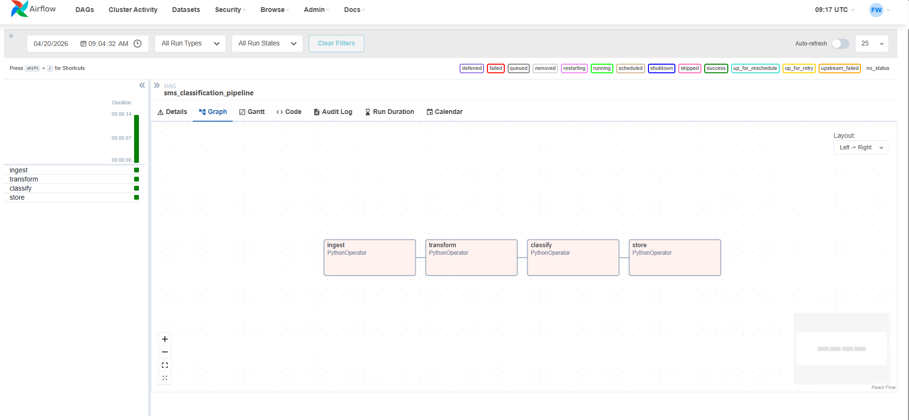

\# SMS Data Pipeline


An MLOps data pipeline project built with Apache Airflow that ingests, transforms, classifies, and stores SMS messages using a live spam classifier API.


## Pipeline graph



\## Pipeline stages


1\. \*\*Ingest\*\* — loads raw SMS data from CSV

2\. \*\*Transform\*\* — cleans, deduplicates, and validates messages

3\. \*\*Classify\*\* — sends each message to the spam classifier API

4\. \*\*Store\*\* — saves results and run summary to SQLite database


\## Stack

\- \*\*Orchestration\*\*: Apache Airflow 2.9.1

\- \*\*Data processing\*\*: Pandas

\- \*\*Storage\*\*: SQLite

\- \*\*Classifier\*\*: \[spam-classifier-api](https://github.com/fwill4040/spam-classifier-api) — live at https://spam-classifier-api-9cfe.onrender.com

\- \*\*Infrastructure\*\*: Docker Compose


\## Project structure

sms-data-pipeline/

├── dags/

│   └── sms\_pipeline.py    # Airflow DAG definition

├── data/

│   └── spam.csv           # UCI SMS spam dataset

├── tests/

│   └── test\_pipeline.py   # Pipeline unit tests

├── logs/                  # Airflow logs

└── docker-compose.yml     # Airflow + Postgres stack


\## Run locally


```bash

docker-compose up airflow-init

docker-compose up airflow-webserver airflow-scheduler

```


Then open http://localhost:8080 — login with admin/admin.


\## Run tests


```bash

pip install pandas pytest

pytest tests/ -v

```


\## Pipeline output


Each run produces:

\- A row per classified message in `sms\_classifications` table

\- A summary row in `pipeline\_runs` table with accuracy, spam count, and error count

